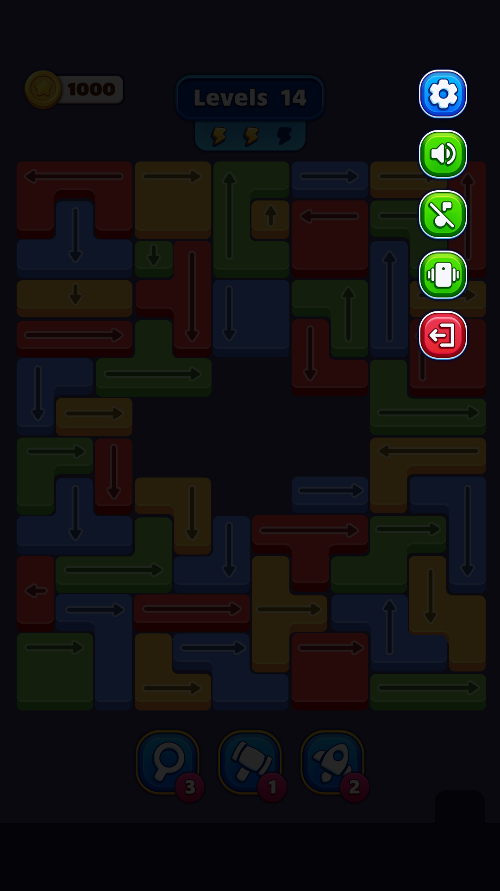

# GameSettingsX

- **Type:** UIState
- **Close Behaviour:** PopOne
- **Pause Previous:** True

## Mock Reference

## Description
Read Assets/Game/Screens/GameSettings/PROMPT.md and the mock image at Assets/Game/Screens/GameSettings/Art/Mock.png

  Then read these reference files:
  - Assets/Saad/Utilities/StateMachine/Scripts/UiViewState.cs
  - Assets/Saad/UI/MainMenu/Scripts/MainMenuView.cs
  - Assets/Saad/UI/MainMenu/Scripts/MainMenuState.cs
  - Assets/Saad/Variables/Persistent/DBBool.cs
  - Assets/Saad/Utilities/Events/GameEvent.cs
  - Assets/Saad/GameFlow/Scripts/ApplicationFlowController.cs
  - Assets/Saad/GameFlow/Scripts/BaseApplicationFlowController.cs

  Implement these files completely, replacing all // AI agent: comments:
  - Assets/Game/Screens/GameSettings/Scripts/GameSettingsUIView.cs
  - Assets/Game/Screens/GameSettings/Scripts/GameSettingsViewData.cs
  - Assets/Game/Screens/GameSettings/Scripts/GameSettingsState.cs

  Rules:
  - Follow MainMenuView/MainMenuState patterns exactly
  - Named methods only, never lambdas in State
  - View fires event Actions upward, State subscribes in Enter, unsubscribes in Exit
  - ViewData is a plain [Serializable] struct with only primitives

  Mock layout: 5 round buttons stacked vertically on the right edge.
  Top = Settings gear (blue, exits state), then Sound toggle (green), Haptics toggle (green), Restore purchases (green), Exit (red, exits state).
  Both Settings and Exit buttons should fire the same exit event.
  Sound and Haptics use DBBool variables — toggle value and refresh view.

  After scripts compile, use MCP to:
  1. Open the prefab at Assets/Game/Screens/GameSettings/Prefabs/GameSettings.prefab
  2. Create child GameObjects under Content: SettingsBtn, SoundBtn, HapticsBtn, RestoreBtn, ExitBtn — each with Button + Image components, anchored
  top-right, stacked vertically (80x80, 10px spacing, 20px right margin, 80px from top)
  3. Create SoundIcon as child of SoundBtn and HapticsIcon as child of HapticsBtn — Image components with 15px inset
  4. Wire all SerializeField references on GameSettingsUIView using execute_code (use GetType().Name matching for component lookup)
  5. Save the prefab

  Then use execute_code to create and assign SO assets:
  1. Create DBBool assets: v_SoundEnabled.asset and v_HapticsEnabled.asset in Config/
  2. Find e_BackBtnPressed.asset in the project (this is the exit event for PopOne states)
  3. Assign on GameSettingsState.asset: GoToHomeEvent = e_BackBtnPressed, SoundEnabled = v_SoundEnabled, HapticsEnabled = v_HapticsEnabled
  4. Verify all fields: stateId, usePooling, PausePreviousState, uIStatesPooler, and the above refs

  The key things this prompt adds over what the clipboard prompt currently generates:

  1. Reads BaseAFC — so the agent understands PopOne/ClearAll and knows to use e_BackBtnPressed
  2. Explicit mock description — doesn't rely on the agent interpreting the image perfectly
  3. Prefab wiring instructions — exact sizing, anchoring, nesting (icons inside buttons)
  4. The GetType().Name workaround — so the agent doesn't hit the generic GetComponent<T>() null bug
  5. Asset creation + assignment — DBBool creation, finding the right exit event, full verification

## AI Agent Instructions
1. Read this prompt and the mock image.
2. Implement all `// AI agent:` TODOs in Scripts/.
3. Named methods only — never lambdas in State.
4. Wire prefab components after compilation.
